# Estimating Joint Models for Longitudinal and Time-to-Event Data with rstanarm

``` r
library(ggplot2)
library(bayesplot)
theme_set(bayesplot::theme_default())
```

## Preamble

This vignette provides an introduction to the `stan_jm` modelling
function in the **rstanarm** package. The `stan_jm` function allows the
user to estimate a shared parameter joint model for longitudinal and
time-to-event data under a Bayesian framework.

## Introduction

Joint modelling can be broadly defined as the simultaneous estimation of
two or more statistical models which traditionally would have been
separately estimated. When we refer to a shared parameter joint model
for longitudinal and time-to-event data, we generally mean the joint
estimation of: 1) a longitudinal mixed effects model which analyses
patterns of change in an outcome variable that has been measured
repeatedly over time (for example, a clinical biomarker) and 2) a
survival or time-to-event model which analyses the time until an event
of interest occurs (for example, death or disease progression). Joint
estimation of these so-called “submodels” is achieved by assuming they
are correlated via individual-specific parameters (i.e. individual-level
random effects).

Over the last two decades the joint modelling of longitudinal and
time-to-event data has received a significant amount of attention
\[1-5\]. Methodological developments in the area have been motivated by
a growing awareness of the benefits that a joint modelling approach can
provide. In clinical or epidemiological research it is common for a
clinical biomarker to be repeatedly measured over time on a given
patient. In addition, it is common for time-to-event data, such as the
patient-specific time from a defined origin (e.g. time of diagnosis of a
disease) until a terminating clinical event such as death or disease
progression to also be collected. The figure below shows observed
longitudinal measurements (i.e. observed “trajectories”) of log serum
bilirubin for a small sample of patients with primary biliary cirrhosis.
Solid lines are used for those patients who were still alive at the end
of follow up, while dashed lines are used for those patients who died.
From the plots, we can observe between-patient variation in the
longitudinal trajectories for log serum bilirubin, with some patients
showing an increase in the biomarker over time, others decreasing, and
some remaining stable. Moreover, there is variation between patients in
terms of the frequency and timing of the longitudinal measurements.  
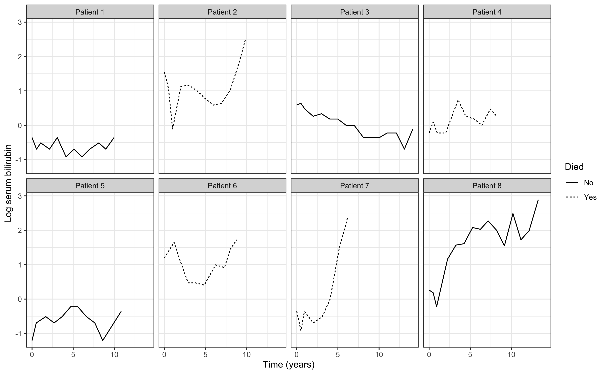

From the perspective of clinical risk prediction, we may be interested
in asking whether the between-patient variation in the log serum
bilirubin trajectories provides meaningful prognostic information that
can help us differentiate patients with regard to some clinical event of
interest, such as death. Alternatively, from an epidemiological
perspective we may wish to explore the potential for etiological
associations between changes in log serum bilirubin and mortality. Joint
modelling approaches provide us with a framework under which we can
begin to answer these types of clinical and epidemiological questions.

More formally, the motivations for undertaking a joint modelling
analysis of longitudinal and time-to-event data might include one or
more of the following:

- One may be interested in how *underlying changes in the biomarker
  influence the occurrence of the event*. However, including the
  observed biomarker measurements directly into a time-to-event model as
  time-varying covariates poses several problems. For example, if the
  widely used Cox proportional hazards model is assumed for the
  time-to-event model then biomarker measurements need to be available
  for all patients at all failure times, which is unlikely to be the
  case \[3\]. If simple methods of imputation are used, such as the
  “last observation carried forward” method, then these are likely to
  induce bias \[6\]. Furthermore, the observed biomarker measurements
  may be subject to measurement error and therefore their inclusion as
  time-varying covariates may result in biased and inefficient
  estimates. In most cases, the measurement error will result in
  parameter estimates which are shrunk towards the null \[7\]. On the
  other hand, joint modelling approaches allow us to estimate the
  association between the biomarker (or some function of the biomarker
  trajectory, such as rate of change in the biomarker) and the risk of
  the event, whilst allowing for both the discrete time and
  measurement-error aspects of the observed biomarker.

- One may be interested primarily in the evolution of the clinical
  biomarker but *may wish to account for what is known as informative
  dropout*. If the value of future (unobserved) biomarker measurements
  are related to the occurrence of the terminating event, then those
  unobserved biomarker measurements will be “missing not at random”
  \[8,9\]. In other words, biomarker measurements for patients who have
  an event will differ from those who do not have an event. Under these
  circumstances, inference based solely on observed measurements of the
  biomarker will be subject to bias. A joint modelling approach can help
  to adjust for informative dropout and has been shown to reduce bias in
  the estimated parameters associated with longitudinal changes in the
  biomarker \[1,9,10\].

- Joint models are naturally suited to the task of *dynamic risk
  prediction*. For example, joint modelling approaches have been used to
  develop prognostic models where predictions of event risk can be
  updated as new longitudinal biomarker measurements become available.
  Taylor et al. \[11\] jointly modelled longitudinal measurements of the
  prostate specific antigen (PSA) and time to clinical recurrence of
  prostate cancer. The joint model was then used to develop a web-based
  calculator which could provide real-time predictions of the
  probability of recurrence based on a patient’s up to date PSA
  measurements.

In this vignette, we describe the **rstanarm** package’s `stan_jm`
modelling function. This modelling function allows users to fit a shared
parameter joint model for longitudinal and time-to-event data under a
Bayesian framework, with the backend estimation carried out using Stan.
In Section 2 we describe the formulation of the joint model used by
`stan_jm`. In Section 3 we present a variety of examples showing the
usage of `stan_jm`.

Note that some aspects of the estimation are covered in other vignettes,
such as the priors
[vignette](https://mc-stan.org/rstanarm/articles/priors.md) which
contains details on the prior distributions available for regression
coefficients.

## Technical details

### Model formulation

A shared parameter joint model consists of related submodels which are
specified separately for each of the longitudinal and time-to-event
outcomes. These are therefore commonly referred to as the *longitudinal
submodel(s)* and the *event submodel*. The longitudinal and event
submodels are linked using shared individual-specific parameters, which
can be parameterised in a number of ways. We describe each of these
submodels below.

#### Longitudinal submodel(s)

We assume \\y\_{ijm}(t) = y\_{im}(t\_{ij})\\ corresponds to the observed
value of the \\m^{th}\\ \\(m = 1,...,M)\\ biomarker for individual \\i\\
\\(i = 1,...,N)\\ taken at time point \\t\_{ij}\\, \\j =
1,...,n\_{im}\\. We specify a (multivariate) generalised linear mixed
model that assumes \\y\_{ijm}(t)\\ follows a distribution in the
exponential family with mean \\\mu\_{ijm}(t)\\ and linear predictor

\\ \eta\_{ijm}(t) = g_m(\mu\_{ijm}(t)) = \boldsymbol{x}^T\_{ijm}(t)
\boldsymbol{\beta}\_m + \boldsymbol{z}^T\_{ijm}(t) \boldsymbol{b}\_{im}
\\

where \\\boldsymbol{x}^T\_{ijm}(t)\\ and \\\boldsymbol{z}^T\_{ijm}(t)\\
are both row-vectors of covariates (which likely include some function
of time, for example a linear slope, cubic splines, or polynomial terms)
with associated vectors of fixed and individual-specific parameters
\\\boldsymbol{\beta}\_m\\ and \\\boldsymbol{b}\_{im}\\, respectively,
and \\g_m\\ is some known link function. The distribution and link
function are allowed to differ over the \\M\\ longitudinal submodels. We
let the vector \\\boldsymbol{\beta} = \\ \boldsymbol{\beta}\_m ; m =
1,...,M\\\\ denote the collection of population-level parameters across
the \\M\\ longitudinal submodels. We assume that the dependence across
the different longitudinal submodels (i.e. the correlation between the
different longitudinal biomarkers) is captured through a shared
multivariate normal distribution for the individual-specific parameters;
that is, we assume

\\ \begin{pmatrix} \boldsymbol{b}\_{i1} \\ \vdots \\
\boldsymbol{b}\_{iM} \end{pmatrix} = \boldsymbol{b}\_i \sim
\mathsf{Normal} \left( 0 , \boldsymbol{\Sigma} \right) \\

for some unstructured variance-covariance matrix
\\\boldsymbol{\Sigma}\\.

#### Event submodel

We assume that we also observe an event time \\T_i = \mathsf{min} \left(
T^\*\_i , C_i \right)\\ where \\T^\*\_i\\ denotes the so-called “true”
event time for individual \\i\\ (potentially unobserved) and \\C_i\\
denotes the censoring time. We define an event indicator \\d_i =
I(T^\*\_i \leq C_i)\\. We then model the hazard of the event using a
parametric proportional hazards regression model of the form

\\ h_i(t) = h_0(t; \boldsymbol{\omega}) \mathsf{exp} \left(
\boldsymbol{w}^T_i(t) \boldsymbol{\gamma} + \sum\_{m=1}^M
\sum\_{q=1}^{Q_m} f\_{mq}(\boldsymbol{\beta}, \boldsymbol{b}\_{i},
\alpha\_{mq}; t) \right) \\

where \\h_i(t)\\ is the hazard of the event for individual \\i\\ at time
\\t\\, \\h_0(t; \boldsymbol{\omega})\\ is the baseline hazard at time
\\t\\ given parameters \\\boldsymbol{\omega}\\,
\\\boldsymbol{w}^T_i(t)\\ is a row-vector of individual-specific
covariates (possibly time-dependent) with an associated vector of
regression coefficients \\\boldsymbol{\gamma}\\ (log hazard ratios),
\\f\_{mq}(.)\\ are a set of known functions for \\m=1,...,M\\ and
\\q=1,...,Q_m\\, and the \\\alpha\_{mq}\\ are regression coefficients
(log hazard ratios).

The longitudinal and event submodels are assumed to be related via an
“association structure”, which is a set of functions each \\\\ f\_{mq} ;
m = 1,...,M, q = 1,...,Q_m \\\\ that may each be conditional on the
population-level parameters from the longitudinal submodel
\\\boldsymbol{\beta}\\, the individual-specific parameters
\\\boldsymbol{b}\_{i}\\, and the population-level parameters
\\\alpha\_{mq}\\ for \\m=1,...,M\\ and \\q=1,...,Q_m\\. That is, the
association structure of the joint model is captured via the
\\\sum\_{m=1}^M \sum\_{q=1}^{Q_m} f\_{mq}(\boldsymbol{\beta}\_m,
\boldsymbol{b}\_{im}, \alpha\_{mq}; t)\\ term in the linear predictor of
the event submodel. The \\\alpha\_{mq}\\ are referred to as the
“association parameters” since they quantify the strength of the
association between the longitudinal and event processes. The various
ways in which the association structure can be are described in the next
section.

The probability of individual \\i\\ still being event-free at time
\\t\\, often referred to as the “survival probability”, is defined as

\\ S_i(t) = \text{Prob} \Big( T_i^\* \geq t \Big) = \exp \Big( -H_i(t)
\Big) \\

where \\H_i(t) = \int\_{s=0}^t h_i(s) ds\\ is the cumulative hazard for
individual \\i\\.

We assume that the baseline hazard \\h_0(t; \boldsymbol{\omega})\\ is
modelled parametrically. In the `stan_jm` modelling function the
baseline hazard be specified as either: an approximation using B-splines
on the log hazard scale (the default); a Weibull distribution; or an
approximation using a piecewise constant function on the log hazard
scale (sometimes referred to as piecewise exponential). The choice of
baseline hazard can be made via the `basehaz` argument. In the case of
the B-splines or piecewise constant baseline hazard, the user can
control the flexibility by specifying the knots or degrees of freedom
via the `basehaz_ops` argument. (Note that currently there is slightly
limited post-estimation functionality available for models estimated
with a piecewise constant baseline hazard, so this is perhaps the least
preferable choice).

#### Association structures

As mentioned in the previous section, the dependence between the
longitudinal and event submodels is captured through the association
structure, which can be specified in a number of ways. The simplest
association structure is likely to be

\\ f\_{mq}(\boldsymbol{\beta}, \boldsymbol{b}\_{im}, \alpha\_{mq}; t) =
\alpha\_{mq} \eta\_{im}(t) \\

and this is often referred to as a *current value* association structure
since it assumes that the log hazard of the event at time \\t\\ is
linearly associated with the value of the longitudinal submodel’s linear
predictor also evaluated at time \\t\\. This is the most common
association structure used in the joint modelling literature to date. In
the situation where the longitudinal submodel is based on an identity
link function and normal error distribution (i.e. a linear mixed model)
the *current value* association structure can be viewed as a method for
including the underlying “true” value of the biomarker as a time-varying
covariate in the event submodel.[¹](#fn1)

However, other association structures are also possible. For example, we
could assume the log hazard of the event is linearly associated with the
*current slope* (i.e. rate of change) of the longitudinal submodel’s
linear predictor, that is

\\ f\_{mq}(\boldsymbol{\beta}, \boldsymbol{b}\_{i}, \alpha\_{mq}; t) =
\alpha\_{mq} \frac{d\eta\_{im}(t)}{dt} \\

There are in fact a whole range of possible association structures, many
of which have been discussed in the literature \[14-16\].

The `stan_jm` modelling function in the **rstanarm** package allows for
the following association structures, which are specified via the
`assoc` argument:

Current value (of the linear predictor or expected value) \\
f\_{mq}(\boldsymbol{\beta}, \boldsymbol{b}\_{i}, \alpha\_{mq}; t) =
\alpha\_{mq} \eta\_{im}(t) \\ f\_{mq}(\boldsymbol{\beta},
\boldsymbol{b}\_{i}, \alpha\_{mq}; t) = \alpha\_{mq} \mu\_{im}(t) \\

Current slope (of the linear predictor or expected value) \\
f\_{mq}(\boldsymbol{\beta}, \boldsymbol{b}\_{i}, \alpha\_{mq}; t) =
\alpha\_{mq} \frac{d\eta\_{im}(t)}{dt} \\ f\_{mq}(\boldsymbol{\beta},
\boldsymbol{b}\_{i}, \alpha\_{mq}; t) = \alpha\_{mq}
\frac{d\mu\_{im}(t)}{dt} \\

Area under the curve (of the linear predictor or expected value) \\
f\_{mq}(\boldsymbol{\beta}, \boldsymbol{b}\_{i}, \alpha\_{mq}; t) =
\alpha\_{mq} \int_0^t \eta\_{im}(u) du \\ f\_{mq}(\boldsymbol{\beta},
\boldsymbol{b}\_{i}, \alpha\_{mq}; t) = \alpha\_{mq} \int_0^t
\mu\_{im}(u) du \\

Interactions between different biomarkers \\ f\_{mq}(\boldsymbol{\beta},
\boldsymbol{b}\_{i}, \alpha\_{mq}; t) = \alpha\_{mq} \eta\_{im}(t)
\eta\_{im'}(t) \text{ for some } m = m' \text{ or } m \neq m' \\
f\_{mq}(\boldsymbol{\beta}, \boldsymbol{b}\_{i}, \alpha\_{mq}; t) =
\alpha\_{mq} \eta\_{im}(t) \mu\_{im'}(t) \text{ for some } m = m' \text{
or } m \neq m' \\ f\_{mq}(\boldsymbol{\beta}, \boldsymbol{b}\_{i},
\alpha\_{mq}; t) = \alpha\_{mq} \mu\_{im}(t) \mu\_{im'}(t) \text{ for
some } m = m' \text{ or } m \neq m' \\

Interactions between the biomarker (or it’s slope) and observed data \\
f\_{mq}(\boldsymbol{\beta}, \boldsymbol{b}\_{i}, \alpha\_{mq}; t) =
\alpha\_{mq} c\_{i}(t) \eta\_{im}(t) \text{ for some covariate value }
c\_{i}(t) \\ f\_{mq}(\boldsymbol{\beta}, \boldsymbol{b}\_{i},
\alpha\_{mq}; t) = \alpha\_{mq} c\_{i}(t) \mu\_{im}(t) \text{ for some
covariate value } c\_{i}(t) \\ f\_{mq}(\boldsymbol{\beta},
\boldsymbol{b}\_{i}, \alpha\_{mq}; t) = \alpha\_{mq} c\_{i}(t)
\frac{d\eta\_{im}(t)}{dt} \text{ for some covariate value } c\_{i}(t) \\
f\_{mq}(\boldsymbol{\beta}, \boldsymbol{b}\_{i}, \alpha\_{mq}; t) =
\alpha\_{mq} c\_{i}(t) \frac{d\mu\_{im}(t)}{dt} \text{ for some
covariate value } c\_{i}(t) \\

As well as using lagged values for any of the above. That is, replacing
\\t\\ with \\t-u\\ where \\u\\ is some lag time, such that the hazard of
the event at time \\t\\ is assumed to be associated with some function
of the longitudinal submodel parameters at time \\t-u\\.

Lastly, we can specify some time-independent function of the random
effects, possibly including the fixed effect component. For example,

\\ f\_{mq}(\boldsymbol{\beta}, \boldsymbol{b}\_{i}, \alpha\_{mq}; t) =
\alpha\_{mq} \boldsymbol{b}\_{im0} \\

or

\\ f\_{mq}(\boldsymbol{\beta}, \boldsymbol{b}\_{i}, \alpha\_{mq}; t) =
\alpha\_{mq} \Big( \boldsymbol{\beta}\_{m0} + \boldsymbol{b}\_{im0}
\Big) \\

where \\\boldsymbol{\beta}\_{m0}\\ is the population-level intercept for
the \\m^{th}\\ longitudinal submodel and \\\boldsymbol{b}\_{im0}\\ is
the \\i^{th}\\ individual’s random deviation from the population-level
intercept for the \\m^{th}\\ longitudinal submodel.

Note that more than one association structure can be specified, however,
not all possible combinations are allowed. Moreover, if you are fitting
a multivariate joint model (i.e. more than one longitudinal outcome)
then you can optionally choose to use a different association
structure(s) for linking each longitudinal submodel to the event
submodel. To do this you can pass a list of length \\M\\ to the `assoc`
argument.

#### Assumptions

Here we define a set of assumptions for the multivariate shared
parameter joint model.

The so-called conditional independence assumption of the shared
parameter joint model postulates

\\ y\_{im}(t) \perp y\_{im'}(t) \mid \boldsymbol{b}\_i,
\boldsymbol{\theta} \\ y\_{im}(t) \perp y\_{im}(t') \mid
\boldsymbol{b}\_i, \boldsymbol{\theta} \\ y\_{im}(t) \perp T_i^\* \mid
\boldsymbol{b}\_i, \boldsymbol{\theta} \\

for some \\m \neq m'\\ and \\t \neq t'\\, and where
\\\boldsymbol{\theta}\\ denotes the combined vector of all remaining
population-level parameters in the model. That is, conditional on the
individual-specific parameters \\\boldsymbol{b}\_i\\ and
population-level parameters \\\boldsymbol{\theta}\\, the following are
assumed: (i) any biomarker measurement for individual \\i\\ is
independent of that individual’s true event time \\T_i^\*\\; (ii) any
two measurements of the \\m^{th}\\ biomarker taken on the \\i^{th}\\
individual at two distinct time points \\t\\ and \\t'\\
(i.e. longitudinal or repeated measurements) are independent of one
another; and (iii) any two measurements of two different biomarkers,
taken on the \\i^{th}\\ individual at some time point \\t\\ are
independent of one another. These conditional independence assumptions
allow for a convenient factorisation of the full likelihood for joint
model into the likelihoods for each of the component parts (i.e. the
likelihood for the longitudinal submodel, the likelihood for the event
submodel, and the likelihood for the distribution of the
individual-specific parameters), which facilitates the estimation of the
model.

Moreover, we require two additional assumptions: (i) that the censoring
process for the event outcome is independent of the true event time,
that is \\C_i \perp T_i^\* \mid \boldsymbol{\theta}\\
(i.e. uninformative censoring); and (ii) that the visiting process by
which the observation times \\t\_{ijm}\\ are determined is independent
of the true event time \\T_i^\*\\ and all missing future unobserved
longitudinal biomarker measurements.

#### Log posterior distribution

Under the conditional independence assumption, the log posterior for the
\\i^{th}\\ individual can be specified as

\\ \log p(\boldsymbol{\theta}, \boldsymbol{b}\_{i} \mid
\boldsymbol{y}\_{i}, T_i, d_i) \propto \log \Bigg\[ \Bigg(
\prod\_{m=1}^M \prod\_{j=1}^{n_i} p(y\_{ijm}(t) \mid
\boldsymbol{b}\_{i}, \boldsymbol{\theta}) \Bigg) p(T_i, d_i \mid
\boldsymbol{b}\_{i}, \boldsymbol{\theta}) p(\boldsymbol{b}\_{i} \mid
\boldsymbol{\theta}) p(\boldsymbol{\theta}) \Bigg\] \\

where \\\boldsymbol{y}\_i = \\ y\_{ijm}(t); j = 1,...,n_i, m = 1,...,M
\\\\ denotes the collection of longitudinal biomarker data for
individual \\i\\ and \\\boldsymbol{\theta}\\ denotes all remaining
population-level parameters in the model.

We can rewrite this log posterior as

\\ \log p(\boldsymbol{\theta}, \boldsymbol{b}\_{i} \mid
\boldsymbol{y}\_{i}, T_i, d_i) \propto \Bigg( \sum\_{m=1}^M
\sum\_{j=1}^{n_i} \log p(y\_{ijm}(t) \mid \boldsymbol{b}\_{i},
\boldsymbol{\theta}) \Bigg) + \log p(T_i, d_i \mid \boldsymbol{b}\_{i},
\boldsymbol{\theta}) + \log p(\boldsymbol{b}\_{i} \mid
\boldsymbol{\theta}) + \log p(\boldsymbol{\theta}) \\

where \\\sum\_{j=1}^{n\_{im}} \log p(y\_{ijm} \mid \boldsymbol{b}\_{i},
\boldsymbol{\theta})\\ is the log likelihood for the \\m^{th}\\
longitudinal submodel, \\\log p(T_i, d_i \mid \boldsymbol{b}\_{i},
\boldsymbol{\theta})\\ is the log likelihood for the event submodel,
\\\log p(\boldsymbol{b}\_{i} \mid \boldsymbol{\theta})\\ is the log
likelihood for the distribution of the group-specific parameters
(i.e. random effects), and \\\log p(\boldsymbol{\theta})\\ represents
the log likelihood for the joint prior distribution across all remaining
unknown parameters.[²](#fn2)

We can rewrite the log likelihood for the event submodel as

\\ \log p(T_i, d_i \mid \boldsymbol{b}\_{i}, \boldsymbol{\theta}) = d_i
\* \log h_i(T_i) - \int_0^{T_i} h_i(s) ds \\

and then use Gauss-Kronrod quadrature with \\Q\\ nodes to approximate
\\\int_0^{T_i} h_i(s) ds\\, such that

\\ \int_0^{T_i} h_i(s) ds \approx \frac{T_i}{2} \sum\_{q=1}^{Q} w_q h_i
\bigg( \frac{T_i(1+s_q)}{2} \bigg) \\

where \\w_q\\ and \\s_q\\, respectively, are the standardised weights
and locations (“abscissa”) for quadrature node \\q\\ \\(q=1,...,Q)\\
\[17\]. The default for the `stan_jm` modelling function is to use
\\Q=15\\ quadrature nodes, however if the user wishes, they can choose
between \\Q=15\\, \\11\\, or \\7\\ quadrature nodes (specified via the
`qnodes` argument).

Therefore, once we have an individual’s event time \\T_i\\ we can
evaluate the design matrices for the event submodel and longitudinal
submodels at the \\Q+1\\ necessary time points (which are the event time
\\T_i\\ and the quadrature points \\\frac{T_i(1+s_q)}{2}\\ for
\\q=1,...,Q\\) and then pass these to Stan’s data block. We can then
evaluate the log likelihood for the event submodel by simply calculating
the hazard \\h_i(t)\\ at those \\Q+1\\ time points and summing the
quantities appropriately. This calculation will need to be performed
each time we iterate through Stan’s model block. A simplified example of
the underlying Stan code used to fit the joint model can be found in
[Brilleman et
al. (2018)](https://github.com/stan-dev/stancon_talks/blob/master/2018/Contributed-Talks/03_brilleman/notebook.pdf)
\[12\].

### Model predictions

Before discussing the methods by which we can generate posterior
predictions, first let us define some additional relevant quantities.
Let \\\mathcal{D} = \\ \boldsymbol{y}\_i, T_i, d_i; i = 1,...,N \\\\ be
the entire collection of outcome data in the sample. We will refer to
this sample as the “training data”. Let \\T\_{max} = \max \\ T_i; i =
1,...,N \\\\ denote the maximum event or censoring time across the \\i =
1,...,N\\ individuals in our training data.

#### Individual-specific predictions for in-sample individuals (for \\0 \leq t \leq T_i\\)

We can generate posterior predictions for the longitudinal and
time-to-event outcomes in the following manner. For the \\i^{th}\\
individual in our training data, a predicted value for the \\m^{th}\\
longitudinal biomarker at time \\t\\, denoted \\y^\*\_{im}(t)\\, can be
generated from the posterior predictive distribution

\\ p \Big( y^{\*}\_{im}(t) \mid \mathcal{D} \Big) = \int \int p \Big(
y^{\*}\_{im}(t) \mid \boldsymbol{\theta}, \boldsymbol{b}\_i \Big) p
\Big( \boldsymbol{\theta}, \boldsymbol{b}\_i \mid \mathcal{D} \Big)
\space d \boldsymbol{b}\_i \space d \boldsymbol{\theta} \\

and, similarly, a predicted probability of the \\i^{th}\\ individual
being event-free at time \\t\\, denoted \\S^\*\_i(t)\\, can be generated
from the posterior predictive distribution

\\ p \Big( S^{\*}\_{i}(t) \mid \mathcal{D} \Big) = \int \int p \Big(
S^{\*}\_i(t) \mid \boldsymbol{\theta}, \boldsymbol{b}\_i \Big) p \Big(
\boldsymbol{\theta}, \boldsymbol{b}\_i \mid \mathcal{D} \Big) d
\boldsymbol{b}\_i \space d \boldsymbol{\theta} \\

Note that for simplicity we have ignored the implicit conditioning on
covariates; \\\boldsymbol{x}\_{im}(t)\\ and \\\boldsymbol{z}\_{im}(t)\\,
for \\m = 1,...,M\\, and \\\boldsymbol{w}\_{i}(t)\\. Since individual
\\i\\ is included in the training data, it is easy for us to approximate
these posterior predictive distributions by drawing from
\\p(y^{\*}\_{im}(t) \mid \boldsymbol{\theta}^{(l)},
\boldsymbol{b}\_i^{(l)})\\ and \\p(S^{\*}\_i(t) \mid
\boldsymbol{\theta}^{(l)}, \boldsymbol{b}\_i^{(l)})\\ where
\\\boldsymbol{\theta}^{(l)}\\ and \\\boldsymbol{b}\_i^{(l)}\\ are the
\\l^{th}\\ \\(l = 1,...,L)\\ MCMC draws from the joint posterior
distribution \\p(\boldsymbol{\theta}, \boldsymbol{b}\_i \mid
\mathcal{D})\\.

These draws from the posterior predictive distributions can be used for
assessing the fit of the model. For example,

- the draws from \\p(y^{\*}\_{im}(t) \mid \mathcal{D})\\ for \\0 \leq t
  \leq T_i\\ can be used to evaluate the fit of the longitudinal
  trajectory for the \\m^{th}\\ biomarker for the \\i^{th}\\ individual,
  and

- the draws from \\p(S^{\*}\_{i}(t) \mid \mathcal{D})\\ for \\0 \leq t
  \leq T\_{max}\\ can be averaged across the \\N\\ individuals to obtain
  a standardised survival curve (discussed in greater detail in later
  sections) which can then be compared to the observed survival curve,
  for example, the Kaplan-Meier curve.

#### Individual-specific predictions for in-sample individuals (for \\t \> C_i\\)

However, given that we know the event or censoring time for each
individual in our training data, it may make more sense to consider what
will happen to censored individuals in our study when we look beyond
their last known survival time (i.e. extrapolation).

For an individual \\i\\, who was in our training data, and who was known
to be event-free up until their censoring time \\C_i\\, we wish to draw
from the conditional posterior predictive distribution for their
longitudinal outcome at some time \\t \> C_i\\, that is

\\ p \Big( y^{\*}\_{im}(t) \mid \mathcal{D}, t \> C_i \Big) = \int \int
p \Big( y^{\*}\_{im}(t) \mid \boldsymbol{\theta}, \boldsymbol{b}\_i, t
\> C_i \Big) p \Big( \boldsymbol{\theta}, \boldsymbol{b}\_i \mid
\mathcal{D} \Big) d \boldsymbol{b}\_i \space d \boldsymbol{\theta} \\

and the conditional posterior predictive distribution for their survival
probability at some time \\t \> C_i\\, that is

\\ \begin{aligned} p \Big( S^{\*}\_{i}(t) \mid \mathcal{D}, t \> C_i,
T_i^\* \> C_i \Big) & = \frac {p \Big( S^{\*}\_{i}(t) \mid \mathcal{D}
\Big)} {p \Big( S^{\*}\_{i}(C_i) \mid \mathcal{D} \Big)} \\ & = \int
\int \frac {p \Big( S^{\*}\_i(t) \mid \boldsymbol{\theta},
\boldsymbol{b}\_i \Big)} {p \Big( S^{\*}\_i(C_i) \mid
\boldsymbol{\theta}, \boldsymbol{b}\_i \Big)} \space p \Big(
\boldsymbol{\theta}, \boldsymbol{b}\_i \mid \mathcal{D} \Big) d
\boldsymbol{b}\_i \space d \boldsymbol{\theta} \end{aligned} \\

These draws from the conditional posterior predictive distributions can
be used to extrapolate into the future for individual \\i\\, conditional
on their longitudinal biomarker data collected between baseline and
their censoring time \\C_i\\. For example,

- the draws from \\p(y^{\*}\_{im}(t) \mid \mathcal{D}, t \> C_i)\\ for
  \\C_i \leq t \leq T\_{max}\\ can be used to show the forecasted
  longitudinal trajectory for the \\m^{th}\\ biomarker for the
  \\i^{th}\\ individual, and

- the draws from \\p(S^{\*}\_{i}(t) \mid \mathcal{D}, t \> C_i, T_i^\*
  \> C_i))\\ for \\C_i \leq t \leq T\_{max}\\ can be used to show the
  estimated conditional probability of individual \\i\\ remaining
  event-free into the future.

#### Individual-specific predictions for out-of-sample individuals (i.e. dynamic predictions)

**TBC.** Describe dynamic predictions under the framework of Rizopoulos
(2011) \[18\]. These types of individual-specific predictions can be
obtained using the `posterior_traj` and `posterior_survfit` functions by
providing prediction data and specifying `dynamic = TRUE` (which is the
default); see the examples provided below.

#### Population-level (i.e. marginal) predictions

We can also generate posterior predictions for the longitudinal and
time-to-event outcomes that do not require any conditioning on observed
outcome data for a specific individual. Here, we will discuss two ways
in which this can be done.

The first way is to “marginalise” over the distribution of the
individual-specific parameters. We wish to generate a predicted value
for the \\m^{th}\\ longitudinal biomarker at time \\t\\ for a new
individual \\k\\ for whom we do not have any observed data. We will
denote this prediction \\y^\*\_{km}(t)\\ and note that it can be
generated from the posterior predictive distribution for the
longitudinal outcome

\\ \begin{aligned} p \Big( y^{\*}\_{km}(t) \mid \mathcal{D} \Big) & =
\int \int p \Big( y^{\*}\_{km}(t) \mid \boldsymbol{\theta},
\boldsymbol{\tilde{b}}\_k \Big) p \Big( \boldsymbol{\theta},
\boldsymbol{\tilde{b}}\_k \mid \mathcal{D} \Big) \space d
\boldsymbol{\tilde{b}}\_{k} \space d \boldsymbol{\theta} \\ & = \int
\int p \Big( y^{\*}\_{km}(t) \mid \boldsymbol{\theta},
\boldsymbol{\tilde{b}}\_k \Big) p \Big( \boldsymbol{\tilde{b}}\_k \mid
\boldsymbol{\theta} \Big) p \Big( \boldsymbol{\theta} \mid \mathcal{D}
\Big) \space d \boldsymbol{\tilde{b}}\_{k} \space d \boldsymbol{\theta}
\end{aligned} \\

and similarly for the survival probability

\\ \begin{aligned} p \Big( S^{\*}\_{k}(t) \mid \mathcal{D} \Big) & =
\int \int p \Big( S^{\*}\_k(t) \mid \boldsymbol{\theta},
\boldsymbol{\tilde{b}}\_k \Big) p \Big( \boldsymbol{\theta},
\boldsymbol{\tilde{b}}\_k \mid \mathcal{D} \Big) d \boldsymbol{b}\_k
\space d \boldsymbol{\theta} \\ & = \int \int p \Big( S^{\*}\_k(t) \mid
\boldsymbol{\theta}, \boldsymbol{\tilde{b}}\_k \Big) p \Big(
\boldsymbol{\tilde{b}}\_k \mid \boldsymbol{\theta} \Big) p \Big(
\boldsymbol{\theta} \mid \mathcal{D} \Big) d \boldsymbol{b}\_k \space d
\boldsymbol{\theta} \\ \end{aligned} \\

We can obtain draws for \\\boldsymbol{\tilde{b}}\_k\\ in the same manner
as for the individual-specific parameters \\\boldsymbol{b}\_i\\. That
is, at the \\l^{th}\\ iteration of the MCMC sampler we draw
\\\boldsymbol{\tilde{b}}\_k^{(l)}\\ and store it[³](#fn3). However,
individual \\k\\ did not provide any contribution to the training data
and so we are effectively taking random draws from the posterior
distribution for the individual-specific parameters. We are therefore
effectively marginalising over the distribution of the group-specific
coefficients when we obtain predictions using the draws
\\\boldsymbol{\tilde{b}}\_k^{(l)}\\ fro \\l = 1,\dots,L\\. In other
words, we are predicting for a new individual whom we have no
information except that they are drawn from the same population as the
\\i = 1,...,N\\ individuals in the training data. Because these
predictions will incorporate all the uncertainty associated with
between-individual variation our 95% credible intervals are likely to be
very wide. These types of marginal predictions can be obtained using the
`posterior_traj` and `posterior_survfit` functions by providing
prediction data and specifying `dynamic = FALSE`; see the examples
provided below.

The second way is to effectively ignore the group-level structure in the
model. That is, to only predict with only the population-level
parameters contributing to the model. For example, under a identity link
function and normal error distribution (i.e. linear mixed effect
longitudinal submodel), we would obtain draws from the distribution
\\y^{(l)}\_{km}(t) \sim N \Big( \boldsymbol{x}^T\_{km}(t)
\boldsymbol{\beta}\_m^{(l)}, \sigma_m^{(l)} \Big)\\ where
\\\boldsymbol{\beta}\_m^{(l)}\\ and \\\sigma_m^{(l)}\\ are the
population-level parameters and residual error standard deviation,
respectively, for the \\l^{th}\\ draw of the MCMC samples. However,
referring to this as a “marginal” prediction is somewhat misleading
since we are not explicitly conditioning on the individual-specific
parameters but we are implicitly assuming that we know they are equal to
zero with absolute certainty. That is, we are actually drawing from the
posterior predictive distribution for the longitudinal outcome

\\ \begin{aligned} p \Big( y^{\*}\_{km}(t) \mid \mathcal{D} \Big) & =
\int p \Big( y^{\*}\_{km}(t) \mid \boldsymbol{\theta}, \boldsymbol{b}\_k
= 0 \Big) p \Big( \boldsymbol{\theta} \mid \mathcal{D} \Big) d
\boldsymbol{\theta} \\ \end{aligned} \\ and similarly for the survival
probability

\\ p \Big( S^{\*}\_{k}(t) \mid \mathcal{D} \Big) = \int p \Big(
S^{\*}\_k(t) \mid \boldsymbol{\theta}, \boldsymbol{b}\_k = 0 \Big) p
\Big( \boldsymbol{\theta} \mid \mathcal{D} \Big) d \boldsymbol{\theta}
\\ \\

These types of so-called “marginal” predictions can not currently be
obtained using the `posterior_traj` and `posterior_survfit` functions.

#### Standardised survival probabilities

All of the previously discussed population-level (i.e. marginal)
predictions assumed implicit conditioning on some covariate values for
the longitudinal submodel, \\\boldsymbol{x}\_{im}(t)\\ and
\\\boldsymbol{z}\_{im}(t)\\ for \\m = 1,...,M\\, and for the event
submodel, \\\boldsymbol{w}\_{i}(t)\\. Even though we marginalise over
the distribution of the individual-specific parameters we were still
assuming that we obtained predictions for some known values of the
covariates. However, sometimes we wish to marginalise (i.e. average)
over the observed distribution of covariates as well. Here we discuss a
method by which we can do that for the predicted survival probabilities.

At any time \\t\\, it is possible to obtain a standardised survival
probability by averaging the individual-specific survival probabilities.
That is, we can obtain

\\ S^\*(t) = \frac{\sum\_{i=1}^{N^{pred}} S_i^\*(t)}{N^{pred}} \\

where \\S_i^\*(t)\\ is the predicted survival probability for individual
\\i\\ (\\i = 1,\dots,N^{pred}\\ at time \\t\\, and \\N^{pred}\\ is the
number of individuals included in the prediction dataset. We refer to
these predictions as *standardised survival probabilities*.

Note however, that if \\N\_{pred}\\ is not sufficiently large (e.g. we
pass new data with just 2 individuals, say) then marginalising over
their covariate distribution may not be meaningful and, similarly, their
joint random effects distribution may be a poor representation of the
random effects distribution for the entire population. It is better to
calculate these standardised survival probabilities using where, say,
\\N^{pred}\\ is equal to the total number of individuals in the training
data.

### Model extensions

#### Delayed entry (left-truncation)

**TBC.**

#### Multilevel clustering

**TBC.**

### Model comparison

#### LOO/WAIC in the context of joint models

**TBC.**

## Usage examples

### Dataset used in the examples

We use the Mayo Clinic’s primary biliary cirrhosis (PBC) dataset in the
examples below. The dataset contains 312 individuals with primary
biliary cirrhosis who participated in a randomised placebo controlled
trial of D-penicillamine conducted at the Mayo Clinic between 1974 and
1984 \[19\]. However, to ensure the examples run quickly, we use a small
random subset of just 40 patients from the full data.

These example data are contained in two separate data frames. The first
data frame contains multiple-row per patient longitudinal biomarker
information, as shown in

``` r
head(pbcLong)
```

      id      age sex trt      year     logBili albumin platelet
    1  1 58.76523   f   1 0.0000000  2.67414865    2.60      190
    2  1 58.76523   f   1 0.5256674  3.05870707    2.94      183
    3  2 56.44627   f   1 0.0000000  0.09531018    4.14      221
    4  2 56.44627   f   1 0.4982888 -0.22314355    3.60      188
    5  2 56.44627   f   1 0.9993155  0.00000000    3.55      161
    6  2 56.44627   f   1 2.1026694  0.64185389    3.92      122

while the second data frame contains single-row per patient survival
information, as shown in

``` r
head(pbcSurv)
```

       id      age sex trt futimeYears status death
    1   1 58.76523   f   1    1.095140      2     1
    3   2 56.44627   f   1   14.151951      0     0
    12  3 70.07255   m   1    2.770705      2     1
    16  4 54.74059   f   1    5.270363      2     1
    23  5 38.10541   f   0    4.120465      1     0
    29  6 66.25873   f   0    6.852841      2     1

The variables included across the two datasets can be defined as
follows:

- `age` in years
- `albumin` serum albumin (g/dl)
- `logBili` logarithm of serum bilirubin
- `death` indicator of death at endpoint
- `futimeYears` time (in years) between baseline and the earliest of
  death, transplantion or censoring
- `id` numeric ID unique to each individual
- `platelet` platelet count
- `sex` gender (m = male, f = female)
- `status` status at endpoint (0 = censored, 1 = transplant, 2 = dead)
- `trt` binary treatment code (0 = placebo, 1 = D-penicillamine)
- `year` time (in years) of the longitudinal measurements, taken as time
  since baseline)

A description of the example datasets can be found by accessing the
following help documentation:

``` r
help("datasets", package = "rstanarm")
```

### Fitting the models

#### Univariate joint model (current value association structure)

In this example we fit a simple univariate joint model, with one
normally distributed longitudinal marker, an association structure based
on the current value of the linear predictor, and B-splines baseline
hazard. To fit the model we use the joint (longitudinal and
time-to-event) modelling function in the **rstanarm** package:
`stan_jm`. When calling `stan_jm` we must, at a minimum, specify a
formula object for each of the longitudinal and event submodels (through
the arguments `formulaLong` and `formulaEvent`), the data frames which
contain the variables for each of the the longitudinal and event
submodels (through the arguments `dataLong` and `dataEvent`), and the
name of the variable representing time in the longitudinal submodel
(through the argument `time_var`).

The formula for the longitudinal submodel is specified using the
**lme4** package formula style. That is
`y ~ x + (random_effects | grouping_factor)`. In this example we specify
that log serum bilirubin (`logBili`) follows a subject-specific linear
trajectory. To do this we include a fixed intercept and fixed slope
(`year`), as well as a random intercept and random slope for each
subject `id` (`(year | id)`).

The formula for the event submodel is specified using the **survival**
package formula style. That is, the outcome of the left of the `~` needs
to be of the format `Surv(event_time, event_indicator)` for single row
per individual data, or `Surv(start_time, stop_time, event_indicator)`
for multiple row per individual data. The latter allows for exogenous
time-varying covariates to be included in the event submodel. In this
example we assume that the log hazard of death is linearly related to
gender (`sex`) and an indicator of treatment with D-penicillamine
(`trt`).

``` r
library(rstanarm)
mod1 <- stan_jm(formulaLong = logBili ~ sex + trt + year + (year | id), 
                dataLong = pbcLong,
                formulaEvent = survival::Surv(futimeYears, death) ~ sex + trt, 
                dataEvent = pbcSurv,
                time_var = "year",
                chains = 1, refresh = 2000, seed = 12345)
```

    Fitting a univariate joint model.

    Please note the warmup may be much slower than later iterations!

    SAMPLING FOR MODEL 'jm' NOW (CHAIN 1).
    Chain 1: 
    Chain 1: Gradient evaluation took 0.000209 seconds
    Chain 1: 1000 transitions using 10 leapfrog steps per transition would take 2.09 seconds.
    Chain 1: Adjust your expectations accordingly!
    Chain 1: 
    Chain 1: 
    Chain 1: Iteration:    1 / 2000 [  0%]  (Warmup)
    Chain 1: Iteration: 1001 / 2000 [ 50%]  (Sampling)
    Chain 1: Iteration: 2000 / 2000 [100%]  (Sampling)
    Chain 1: 
    Chain 1:  Elapsed Time: 19.324 seconds (Warm-up)
    Chain 1:                20.006 seconds (Sampling)
    Chain 1:                39.33 seconds (Total)
    Chain 1: 

The argument `refresh = 2000` was specified so that Stan didn’t provide
us with excessive progress updates whilst fitting the model. However, if
you are fitting a model that will take several minutes or hours to fit,
then you may wish to request progress updates quite regularly, for
example setting `refresh = 20` for every 20 iterations (by default the
refresh argument is set to 1/10th of the total number of iterations).

The fitted model is returned as an object of the S3 class `stanjm`. We
have a variety of methods and post-estimation functions available for
this class, including: `print`, `summary`, `plot`, `fixef`, `ranef`,
`coef`, `VarCorr`, `posterior_interval`, `update`, and more. Here, we
will examine the most basic output for the fitted joint model by typing
`print(mod1)`:

    stan_jm
     formula (Long1): logBili ~ sex + trt + year + (year | id)
     family  (Long1): gaussian [identity]
     formula (Event): survival::Surv(futimeYears, death) ~ sex + trt
     baseline hazard: bs
     assoc:           etavalue (Long1)
    ------

    Longitudinal submodel: logBili
                Median MAD_SD
    (Intercept)  0.304  0.558
    sexf         0.477  0.523
    trt         -0.127  0.370
    year         0.212  0.043
    sigma        0.354  0.016

    Event submodel:
                    Median MAD_SD exp(Median)
    (Intercept)     -3.179  0.621  0.042     
    sexf            -0.336  0.620  0.715     
    trt             -0.720  0.415  0.487     
    Long1|etavalue   1.341  0.238  3.821     
    b-splines-coef1 -0.836  1.035     NA     
    b-splines-coef2  0.518  0.881     NA     
    b-splines-coef3 -1.797  1.196     NA     
    b-splines-coef4  0.299  1.652     NA     
    b-splines-coef5 -0.061  1.665     NA     
    b-splines-coef6 -0.820  1.665     NA     

    Group-level error terms:
     Groups Name              Std.Dev. Corr
     id     Long1|(Intercept) 1.2954       
            Long1|year        0.1921   0.52
    Num. levels: id 40 

    Sample avg. posterior predictive distribution 
    of longitudinal outcomes:
                   Median MAD_SD
    Long1|mean_PPD 0.585  0.032 

    ------
    For info on the priors used see help('prior_summary.stanreg').

The “Long1\|etavalue” row under “Event submodel” is our \\\alpha\_{mq}\\
parameter (\\m = 1\\, \\q = 1\\). The estimated median of tells us that
for each one unit increase in an individual’s underlying level of log
serum bilirubin, their estimated log hazard of death increases by some
amount. The mean absolute deviation (MAD) is provided as a more robust
estimate of the standard deviation of the posterior distribution. In
this case the MAD_SD for the association parameter indicates there is
quite large uncertainty around the estimated association between log
serum bilirubin and risk of death (recall this is a small dataset).

If we wanted some slightly more detailed output for each of the model
parameters, as well as further details regarding the model estimation
(for example computation time, number of longitudinal observations,
number of individuals, type of baseline hazard, etc) we can instead use
the `summary` method:

``` r
summary(mod1, probs = c(.025,.975))
```

    Model Info:

     function:        stan_jm
     formula (Long1): logBili ~ sex + trt + year + (year | id)
     family  (Long1): gaussian [identity]
     formula (Event): survival::Surv(futimeYears, death) ~ sex + trt
     baseline hazard: bs
     assoc:           etavalue (Long1)
     algorithm:       sampling
     priors:          see help('prior_summary')
     sample:          1000 (posterior sample size)
     num obs:         304 (Long1)
     num subjects:    40
     num events:      29 (72.5%)
     groups:          id (40)
     runtime:         0.6 mins

    Estimates:
                                                    mean     sd       2.5%  
    Long1|(Intercept)                                0.294    0.586   -0.926
    Long1|sexf                                       0.499    0.560   -0.529
    Long1|trt                                       -0.144    0.386   -0.973
    Long1|year                                       0.214    0.042    0.136
    Long1|sigma                                      0.354    0.017    0.324
    Long1|mean_PPD                                   0.586    0.030    0.527
    Event|(Intercept)                               -3.191    0.622   -4.477
    Event|sexf                                      -0.299    0.620   -1.407
    Event|trt                                       -0.740    0.445   -1.663
    Event|b-splines-coef1                           -0.949    1.065   -3.263
    Event|b-splines-coef2                            0.462    0.908   -1.410
    Event|b-splines-coef3                           -1.807    1.186   -4.100
    Event|b-splines-coef4                            0.388    1.567   -2.682
    Event|b-splines-coef5                           -0.077    1.647   -3.410
    Event|b-splines-coef6                           -1.014    1.692   -4.884
    Assoc|Long1|etavalue                             1.347    0.237    0.915
    Sigma[id:Long1|(Intercept),Long1|(Intercept)]    1.678    0.438    1.012
    Sigma[id:Long1|year,Long1|(Intercept)]           0.129    0.076    0.018
    Sigma[id:Long1|year,Long1|year]                  0.037    0.020    0.014
    log-posterior                                 -329.512    9.997 -349.426
                                                    97.5% 
    Long1|(Intercept)                                1.367
    Long1|sexf                                       1.627
    Long1|trt                                        0.582
    Long1|year                                       0.299
    Long1|sigma                                      0.387
    Long1|mean_PPD                                   0.647
    Event|(Intercept)                               -2.068
    Event|sexf                                       1.036
    Event|trt                                        0.128
    Event|b-splines-coef1                            0.882
    Event|b-splines-coef2                            2.114
    Event|b-splines-coef3                            0.370
    Event|b-splines-coef4                            3.494
    Event|b-splines-coef5                            2.989
    Event|b-splines-coef6                            1.810
    Assoc|Long1|etavalue                             1.829
    Sigma[id:Long1|(Intercept),Long1|(Intercept)]    2.703
    Sigma[id:Long1|year,Long1|(Intercept)]           0.300
    Sigma[id:Long1|year,Long1|year]                  0.085
    log-posterior                                 -311.470

    Diagnostics:
                                                  mcse  Rhat  n_eff
    Long1|(Intercept)                             0.029 0.999  411 
    Long1|sexf                                    0.028 0.999  407 
    Long1|trt                                     0.023 1.001  281 
    Long1|year                                    0.002 0.999  288 
    Long1|sigma                                   0.001 1.002  953 
    Long1|mean_PPD                                0.001 1.001 1165 
    Event|(Intercept)                             0.019 1.001 1131 
    Event|sexf                                    0.018 1.002 1156 
    Event|trt                                     0.013 0.999 1149 
    Event|b-splines-coef1                         0.040 0.999  703 
    Event|b-splines-coef2                         0.029 1.000 1008 
    Event|b-splines-coef3                         0.046 0.999  660 
    Event|b-splines-coef4                         0.065 0.999  589 
    Event|b-splines-coef5                         0.064 0.999  654 
    Event|b-splines-coef6                         0.061 0.999  767 
    Assoc|Long1|etavalue                          0.007 0.999 1074 
    Sigma[id:Long1|(Intercept),Long1|(Intercept)] 0.025 0.999  306 
    Sigma[id:Long1|year,Long1|(Intercept)]        0.006 1.001  182 
    Sigma[id:Long1|year,Long1|year]               0.001 1.003  214 
    log-posterior                                 0.708 1.002  199 

    For each parameter, mcse is Monte Carlo standard error, n_eff is a crude measure of effective sample size, and Rhat is the potential scale reduction factor on split chains (at convergence Rhat=1).

The easiest way to extract the correlation matrix for the random effects
(aside from viewing the `print` output) is to use the `VarCorr` function
(modelled on the `VarCorr` function from the **lme4** package). If you
wish to extract the variances and covariances (instead of the standard
deviations and correlations) then you can type the following to return a
data frame with all of the relevant information:

``` r
as.data.frame(VarCorr(mod1))
```

      grp              var1       var2       vcov     sdcor
    1  id Long1|(Intercept)       <NA> 1.67802152 1.2953847
    2  id        Long1|year       <NA> 0.03691896 0.1921431
    3  id Long1|(Intercept) Long1|year 0.12937327 0.5197818

#### Univariate joint model (current value and current slope association structure)

In the previous example we were fitting a shared parameter joint model
which assumed that the log hazard of the event (in this case the log
hazard of death) at time *t* was linearly related to the
subject-specific expected value of the longitudinal marker (in this case
the expected value of log serum bilirubin) also at time *t*. This is the
default association structure, although it could be explicitly specified
by setting the `assoc = "etavalue"` argument.

However, let’s suppose we believe that the log hazard of death is
actually related to both the *current value* of log serum bilirubin and
the current *rate of change* in log serum bilirubin. To estimate this
joint model we need to indicate that we want to also include the
subject-specific slope (at time *t*) from the longitudinal submodel as
part of the association structure. We do this by setting the `assoc`
argument equal to a character vector `c("etavalue", "etaslope")` which
indicates our desired association structure:

``` r
mod2 <- stan_jm(formulaLong = logBili ~ sex + trt + year + (year | id), 
                dataLong = pbcLong,
                formulaEvent = survival::Surv(futimeYears, death) ~ sex + trt, 
                dataEvent = pbcSurv,
                assoc = c("etavalue", "etaslope"),
                time_var = "year", 
                chains = 1, refresh = 2000, seed = 12345)
```

In this example the subject-specific slope is actually constant across
time *t* since we have a linear trajectory. Note however that we could
still use the `"etaslope"` association structure even if we had a
non-linear subject specific trajectory (for example modelled using cubic
splines or polynomials).

#### Multivariate joint model (current value association structures)

Suppose instead that we were interested in *two* repeatedly measured
clinical biomarkers, log serum bilirubin and serum albumin, and their
association with the risk of death. We may wish to model these two
biomarkers, allowing for the correlation between them, and estimating
their respective associations with the log hazard of death. We will fit
a linear mixed effects submodel (identity link, normal distribution) for
each biomarker with a patient-specific intercept and linear slope but no
other covariates. In the event submodel we will include gender (`sex`)
and treatment (`trt`) as baseline covariates. Each biomarker is assumed
to be associated with the log hazard of death at time \\t\\ via it’s
expected value at time \\t\\ (i.e. a *current value* association
structure).

The model we are going to fit can therefore be specified as:

\\ y\_{im}(t\_{ijm}) \sim N(\mu\_{im}(t\_{ijm}), \sigma_m) \\

\\ \eta\_{im}(t) = \mu\_{im}(t) = \beta\_{0m} + \beta\_{1m} t +
b\_{0mi} + b\_{1mi} t \\

\\ h_i(t) = h_0(t; \boldsymbol{\omega}) \exp(\gamma_1 w\_{1i} + \gamma_2
w\_{2i} + \alpha\_{1i} \mu\_{i1}(t) + \alpha\_{2i} \mu\_{i2}(t)) \\

where \\t\\ is time in years, and \\w\_{1i}\\ and \\w\_{2i}\\ are,
respectively, the gender and treatment indicators for individual \\i\\.

(Note that due to the very small sample size, the clinical findings from
this analysis should not to be overinterpreted!).

``` r
mod3 <- stan_jm(
    formulaLong = list(
        logBili ~ sex + trt + year + (year | id), 
        albumin ~ sex + trt + year + (year | id)),
    formulaEvent = survival::Surv(futimeYears, death) ~ sex + trt, 
    dataLong = pbcLong, dataEvent = pbcSurv,
    time_var = "year",
    chains = 1, refresh = 2000, seed = 12345)
```

    Fitting a multivariate joint model.

    Please note the warmup may be much slower than later iterations!

    SAMPLING FOR MODEL 'jm' NOW (CHAIN 1).
    Chain 1: 
    Chain 1: Gradient evaluation took 0.000314 seconds
    Chain 1: 1000 transitions using 10 leapfrog steps per transition would take 3.14 seconds.
    Chain 1: Adjust your expectations accordingly!
    Chain 1: 
    Chain 1: 
    Chain 1: Iteration:    1 / 2000 [  0%]  (Warmup)
    Chain 1: Iteration: 1001 / 2000 [ 50%]  (Sampling)
    Chain 1: Iteration: 2000 / 2000 [100%]  (Sampling)
    Chain 1: 
    Chain 1:  Elapsed Time: 34.776 seconds (Warm-up)
    Chain 1:                35.724 seconds (Sampling)
    Chain 1:                70.5 seconds (Total)
    Chain 1: 

We can now examine the output from the fitted model, for example  

``` r
print(mod3)
```

    stan_jm
     formula (Long1): logBili ~ sex + trt + year + (year | id)
     family  (Long1): gaussian [identity]
     formula (Long2): albumin ~ sex + trt + year + (year | id)
     family  (Long2): gaussian [identity]
     formula (Event): survival::Surv(futimeYears, death) ~ sex + trt
     baseline hazard: bs
     assoc:           etavalue (Long1), etavalue (Long2)
    ------

    Longitudinal submodel 1: logBili
                Median MAD_SD
    (Intercept)  0.263  0.508
    sexf         0.475  0.487
    trt         -0.063  0.374
    year         0.222  0.043
    sigma        0.354  0.017

    Longitudinal submodel 2: albumin
                Median MAD_SD
    (Intercept)  3.471  0.224
    sexf         0.066  0.240
    trt          0.000  0.168
    year        -0.156  0.023
    sigma        0.291  0.013

    Event submodel:
                    Median  MAD_SD  exp(Median)
    (Intercept)       6.854   2.660 947.312    
    sexf             -0.101   0.652   0.904    
    trt              -0.501   0.500   0.606    
    Long1|etavalue    0.805   0.312   2.236    
    Long2|etavalue   -3.075   0.834   0.046    
    b-splines-coef1  -0.973   1.138      NA    
    b-splines-coef2   0.546   0.849      NA    
    b-splines-coef3  -2.571   1.352      NA    
    b-splines-coef4  -0.645   1.807      NA    
    b-splines-coef5  -1.276   1.887      NA    
    b-splines-coef6  -2.704   1.864      NA    

    Group-level error terms:
     Groups Name              Std.Dev. Corr             
     id     Long1|(Intercept) 1.24123                   
            Long1|year        0.18822   0.49            
            Long2|(Intercept) 0.51395  -0.65 -0.49      
            Long2|year        0.09606  -0.57 -0.81  0.45
    Num. levels: id 40 

    Sample avg. posterior predictive distribution 
    of longitudinal outcomes:
                   Median MAD_SD
    Long1|mean_PPD 0.588  0.030 
    Long2|mean_PPD 3.343  0.025 

    ------
    For info on the priors used see help('prior_summary.stanreg').

or we can examine the summary output for the association parameters
alone:  

``` r
summary(mod3, pars = "assoc")
```

    Model Info:

     function:        stan_jm
     formula (Long1): logBili ~ sex + trt + year + (year | id)
     family  (Long1): gaussian [identity]
     formula (Long2): albumin ~ sex + trt + year + (year | id)
     family  (Long2): gaussian [identity]
     formula (Event): survival::Surv(futimeYears, death) ~ sex + trt
     baseline hazard: bs
     assoc:           etavalue (Long1), etavalue (Long2)
     algorithm:       sampling
     priors:          see help('prior_summary')
     sample:          1000 (posterior sample size)
     num obs:         304 (Long1), 304 (Long2)
     num subjects:    40
     num events:      29 (72.5%)
     groups:          id (40)
     runtime:         1.2 mins

    Estimates:
                           mean   sd     2.5%   25%    50%    75%    97.5%
    Assoc|Long1|etavalue  0.806  0.301  0.236  0.593  0.805  1.014  1.397 
    Assoc|Long2|etavalue -3.142  0.872 -4.946 -3.657 -3.075 -2.532 -1.603 

    Diagnostics:
                         mcse  Rhat  n_eff
    Assoc|Long1|etavalue 0.009 0.999 1189 
    Assoc|Long2|etavalue 0.032 1.000  763 

    For each parameter, mcse is Monte Carlo standard error, n_eff is a crude measure of effective sample size, and Rhat is the potential scale reduction factor on split chains (at convergence Rhat=1).

### Posterior predictions

We can also access the range of post-estimation functions (described in
the `stan_jm` and related help documentation; see for example
[`help(posterior_traj)`](https://mc-stan.org/rstanarm/reference/posterior_traj.md)
or
[`help(posterior_survfit)`](https://mc-stan.org/rstanarm/reference/posterior_survfit.md)).

#### Predicted individual-specific longitudinal trajectory for in-sample individuals

Predicted individual-specific biomarker values can be obtained using
either the `posterior_traj` or `posterior_predict` function. The
`posterior_traj` is preferable, because it can be used to obtain the
biomarker values at a series of evenly spaced time points between
baseline and the individual’s event or censoring time by using the
default `interpolate = TRUE` option. Whereas, the `posterior_predict`
function only provides the predicted biomarker values at the observed
time points, or the time points in the new data. Predicting the
biomarker values at a series of evenly spaced time points can be
convenient because they can be easily used for plotting the longitudinal
trajectory. Moreover, by default the `posterior_traj` returns a data
frame with variables corresponding to the individual ID, the time, the
predicted mean biomarker value, the limits for the 95% credible interval
(i.e. uncertainty interval for the predicted mean biomarker value), and
limits for the 95% prediction interval (i.e. uncertainty interval for a
predicted biomarker data point), where the level for the uncertainty
intervals can be changed via the `prob` argument. Conversely, the
`posterior_predict` function returns an \\S\\ by \\N\\ matrix of
predictions where \\S\\ is the number of posterior draws and \\N\\ is
the number of prediction time points (note that this return type can
also be obtained for `posterior_traj` by specifying the argument
`return_matrix = TRUE`).

As an example, let’s plot the predicted individual-specific longitudinal
trajectories for each of the two biomarkers (log serum bilirubin and
serum albumin) in the multivariate joint model estimated above. We will
do this for three individuals (IDs 6, 7 and 8) who were included in the
model estimation.

Here are the plots for log serum bilirubin:

``` r
p1 <- posterior_traj(mod3, m = 1, ids = 6:8)
pp1 <- plot(p1, plot_observed = TRUE)
pp1
```

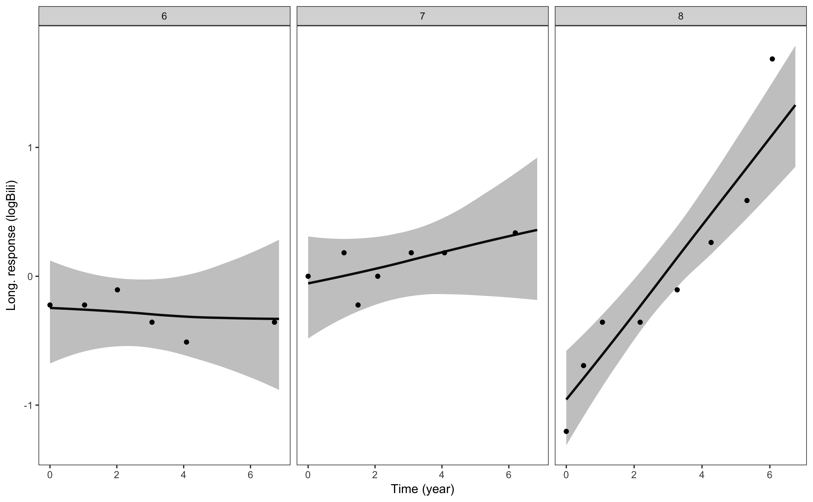

and here are the plots for serum albumin:

``` r
p2 <- posterior_traj(mod3, m = 2, ids = 6:8)
pp2 <- plot(p2, plot_observed = TRUE)
pp2
```

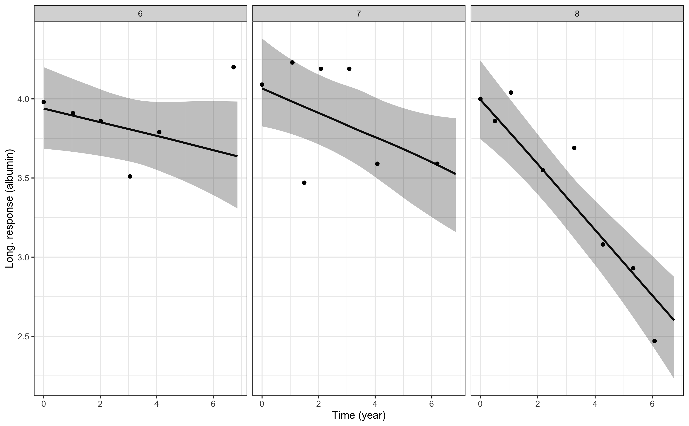

The `m` argument specifies which biomarker we want to predict for (only
relevant for a multivariate joint model). The `ids` argument is
optional, and specifies a subset of individuals for whom we want to
predict. In the plotting method, the `plot_observed = TRUE` specifies
that we want to include the observed biomarker values in the plot of the
longitudinal trajectory.

If we wanted to extrapolate the trajectory forward from the event or
censoring time for each individual, then this can be easily achieved by
specifying `extrapolate = TRUE` in the `posterior_traj` call. For
example, here is the plot for log serum bilirubin with extrapolation:

``` r
p3 <- posterior_traj(mod3, m = 1, ids = 6:8, extrapolate = TRUE)
pp3 <- plot(p3, plot_observed = TRUE, vline = TRUE)
pp3
```

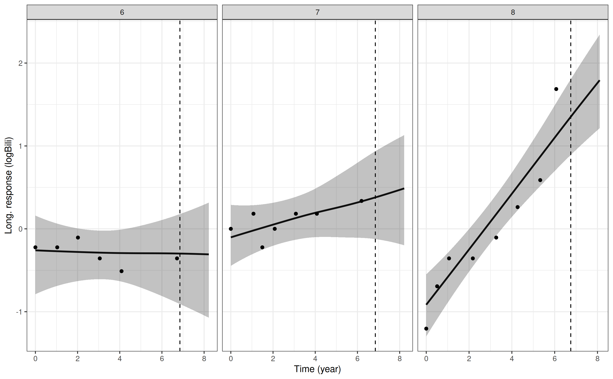

and for serum albumin with extrapolation:

``` r
p4 <- posterior_traj(mod3, m = 2, ids = 6:8, extrapolate = TRUE)
pp4 <- plot(p4, plot_observed = TRUE, vline = TRUE)
pp4
```

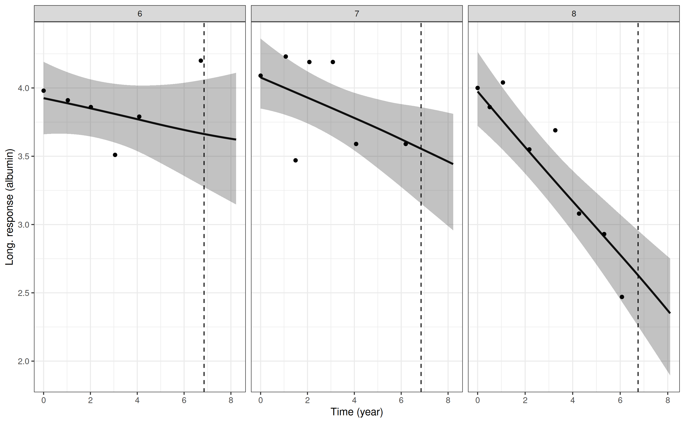

Here, we included the `vline = TRUE` which adds a vertical dashed line
at the timing of the individual’s event or censoring time. The
interpolation and extrapolation of the biomarker trajectory can be
further controlled through the `control` argument to the
`posterior_traj` function; for example, we could specify the number of
time points at which to predict, the distance by which to extrapolate,
and so on.

We could customize these plots further, for example, by using any of the
**ggplot2** functionality or using the additional arguments described in
[`help(plot.predict.stanjm)`](https://mc-stan.org/rstanarm/reference/plot.predict.stanjm.md).

#### Predicted individual-specific survival curves for in-sample individuals

Predicted individual-specific survival probabilities and/or survival
curves can be obtained using the `posterior_survfit` function. The
function by default returns a data frame with the individual ID, the
time, and the predicted survival probability (posterior mean and limits
for the 95% credible interval). The uncertainty level for the credible
interval can be changed via the `prob` argument. By default,
individual-specific survival probabilities are calculated *conditional*
on the individual’s last known survival time. When we are predicting
survival probabilities for individuals that were used in the estimation
of the model (i.e. in-sample individuals, where no new covariate data is
provided), then the individual’s “last known survival time” will be
their event or censoring time. (Note that if we wanted didn’t want to
condition on the individual’s last known survival time, then we could
specify `condition = FALSE`, but we probably wouldn’t want to do this
unless we were calculating marginal or standardised survival
probabilities, which are discussed later).

The default argument `extrapolate = TRUE` specifies that the
individual-specific conditional survival probabilities will be
calculated at evenly spaced time points between the individual’s last
known survival time and the maximum follow up time that was observed in
the estimation sample. The behaviour of the extrapolation can be further
controlled via the `control` argument. If we were to specify
`extrapolate = FALSE` then the survival probabilities would only be
calculated at one time point, which could be specified in the `times`
argument (or otherwise would default to the individual’s last known
survival time).

As an example, let plot the predicted individual-specific conditional
survival curve for the same three individual’s that were used in the
previous example. The predicted survival curve will be obtained under
the multivariate joint model estimated above.  

``` r
p5 <- posterior_survfit(mod3, ids = 6:8)
pp5 <- plot(p5)
pp5
```

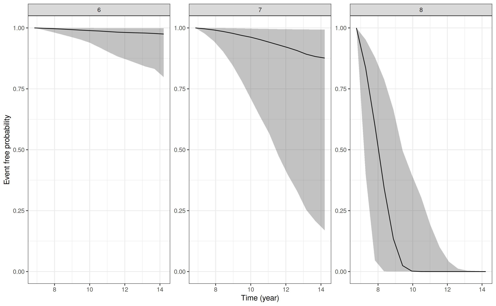

We could customize the plot further, for example, by using any of the
**ggplot2** functionality or using the additional arguments described in
[`help(plot.survfit.stanjm)`](https://mc-stan.org/rstanarm/reference/plot.survfit.stanjm.md).

#### Combined plot of longitudinal trajectories and survival curves

The package also provides a convenience plotting function, which
combines plots of the individual-specific longitudinal trajectories, and
the individual-specific survival function. We can demonstrate this by
replotting the predictions for the three individuals in the previous
example:

``` r
plot_stack_jm(yplot = list(pp3, pp4), survplot = pp5)
```

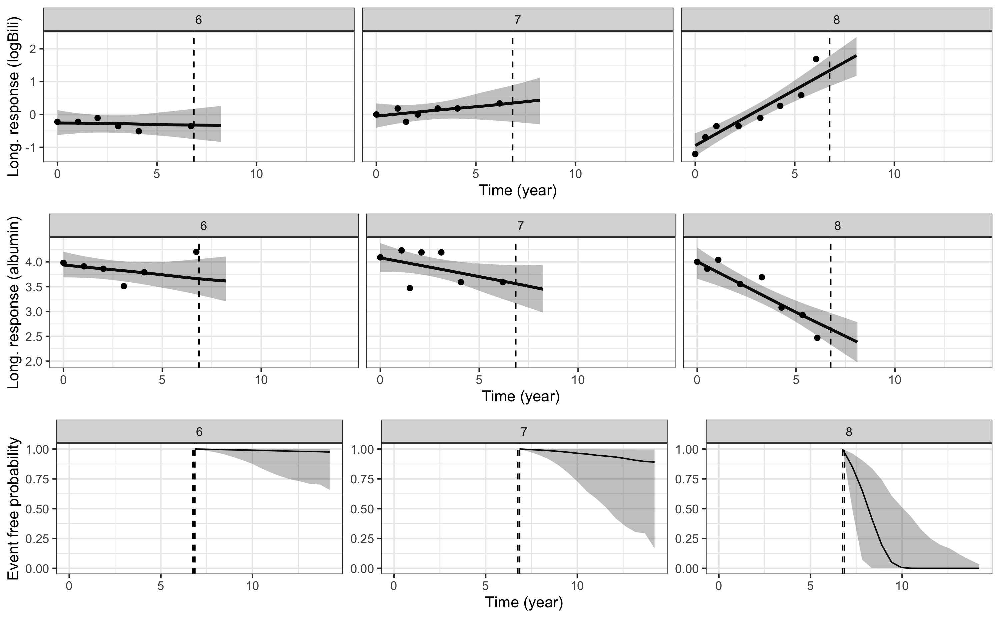

Here we can see the strong relationship between the underlying values of
the biomarkers and mortality. Patient `8` who, relative to patients `6`
and `7`, has a higher underlying value for log serum bilirubin and a
lower underlying value for serum albumin at the end of their follow up
has a far worse predicted probability of survival.

#### Predicted individual-specific longitudinal trajectory and survival curve for out-of-sample individuals (i.e. dynamic predictions)

Let us take an individual from our training data, in this case the
individual with subject ID value `8`. However, we will pretend this
individual was not a member of our training data and rather that they
are a new individual for whom we have obtained new biomarker
measurements. Our goal is to obtain predictions for the longitudinal
trajectory for this individual, and their conditional survival curve,
given that we know they are conditional on their biomarker measurements
we currently have available.

First, let’s extract the data for subject `8` and then rename their
subject ID value so that they appear to be an individual who was not
included in our training dataset:

``` r
ndL <- pbcLong[pbcLong$id == 8, , drop = FALSE]
ndE <- pbcSurv[pbcSurv$id == 8, , drop = FALSE]
ndL$id <- paste0("new_patient")
ndE$id <- paste0("new_patient")
```

Note that we have both the longitudinal data and event data for this new
individual. We require data for both submodels because we are going to
generate *dynamic predictions* that require drawing new
individual-specific parameters (i.e. random effects) for this individual
conditional on their observed data. That means we need to evaluate the
likelihood for the full joint model and that requires both the
longitudinal and event data (note however that the status indicator
`death` will be ignored, since it is assumed that the individual we are
predicting for is still alive at the time we wish to generate the
predictions).

Now we can pass this data to the `posterior_traj` function in the same
way as for the in-sample individuals, except we will now specify the
`newdataLong` and `newdataEvent` arguments. We will also specify the
`last_time` argument so that the function knows which variable in the
event data specifies the individual’s last known survival time (the
default behaviour is to use the time of the last biomarker measurement).

Our predictions for this new individual for the log serum bilirubin
trajectory can be obtained using:

``` r
p6 <- posterior_traj(mod3, m = 1, 
                     newdataLong = ndL, 
                     newdataEvent = ndE,
                     last_time = "futimeYears")
```

    Drawing new random effects for 1 individuals. Monitoring progress:
      |                                                                              |                                                                      |   0%  |                                                                              |======================================================================| 100%

``` r
pp6 <- plot(p6, plot_observed = TRUE, vline = TRUE)
pp6
```

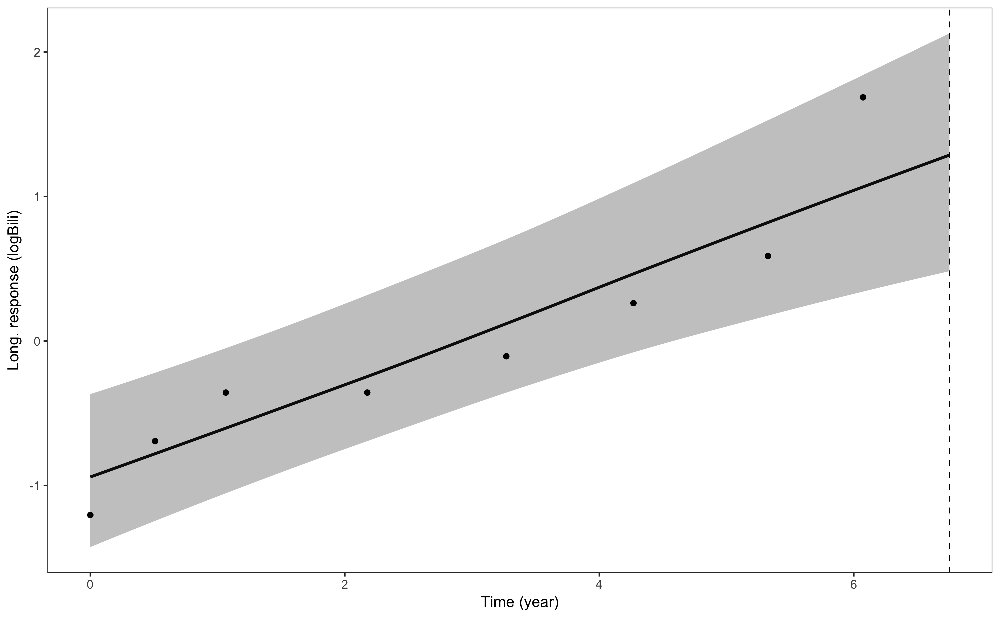

and for the serum albumin trajectory:

``` r
p7 <- posterior_traj(mod3, m = 2, 
                     newdataLong = ndL, 
                     newdataEvent = ndE,
                     last_time = "futimeYears")
```

    Drawing new random effects for 1 individuals. Monitoring progress:
      |                                                                              |                                                                      |   0%  |                                                                              |======================================================================| 100%

``` r
pp7 <- plot(p7, plot_observed = TRUE, vline = TRUE)
pp7
```

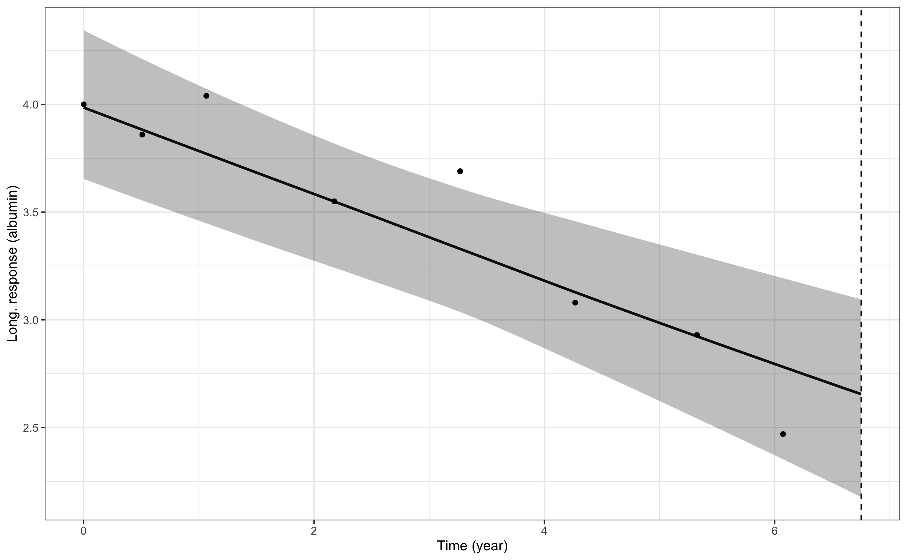

For the conditional survival probabilities we use similar information,
provided to the `posterior_survfit` function:

``` r
p8 <- posterior_survfit(mod3,
                        newdataLong = ndL, 
                        newdataEvent = ndE,
                        last_time = "futimeYears")
```

    Drawing new random effects for 1 individuals. Monitoring progress:
      |                                                                              |                                                                      |   0%  |                                                                              |======================================================================| 100%

``` r
pp8 <- plot(p8)
pp8
```

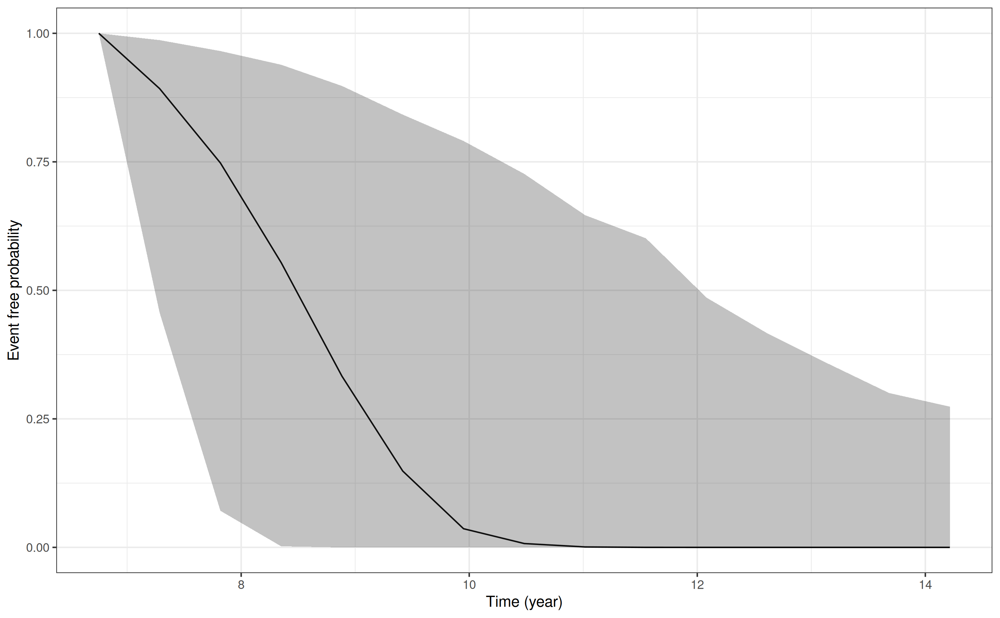

We can then use the `plot_stack_jm` function, as we saw in a previous
example, to stack the plots of the longitudinal trajectory and the
conditional survival curve:

``` r
plot_stack_jm(yplot = list(pp6, pp7), survplot = pp8)
```

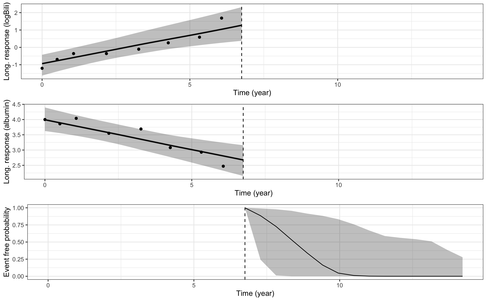

Here we see that the predicted longitudinal trajectories and conditional
survival curve for this individual, obtained using the dynamic
predictions approach, are similar to the predictions we obtained when we
used their individual-specific parameters from the original model
estimation. This is because in both situations we are conditioning on
the same outcome data.

**Side note:** We can even compare the estimated individual specific
parameters obtained under the two approaches. For example, here is the
posterior mean for the estimated individual-specific parameters for
individual `8` from the fitted model:

``` r
c(ranef(mod3)[["Long1"]][["id"]][8,], 
  ranef(mod3)[["Long2"]][["id"]][8,])
```

    $`(Intercept)`
    [1] -1.636025

    $year
    [1] 0.1106856

    $`(Intercept)`
    [1] 0.4636367

    $year
    [1] -0.04915748

and here is the mean of the draws for the individual-specific parameters
for individual `8` under the dynamic predictions approach:

``` r
colMeans(attr(p6, "b_new"))
```

    b[Long1|(Intercept) id:new_patient]        b[Long1|year id:new_patient] 
                            -1.65217893                          0.10504485 
    b[Long2|(Intercept) id:new_patient]        b[Long2|year id:new_patient] 
                             0.45330164                         -0.03059108 

#### Predicted population-level longitudinal trajectory

Suppose we wanted to predict the longitudinal trajectory for each of the
biomarkers, marginalising over the distribution of the
individual-specific parameters. To do this, we can pass a new data frame
with the covariate values we want to use in the predictions. Here, we
will demonstrate this by obtaining the predicted trajectory for log
serum bilirubin, under the multivariate joint model that was estimated
previously. Our prediction data will require the variables `year`, `sex`
and `trt`, since these were the covariates used in the longitudinal
submodel.

We will predict the value of log serum bilirubin at years 0 through 10,
for each combination of `sex` and `trt`. We also need to include the
`id` variable in our prediction data because this is relevant to the
longitudinal submodel. Since we want to marginalise over the
individual-specific parameters (i.e. individual-level random effects) we
need to note two things:

- First, the values for the `id` variable **must not** match any
  individual used in the model estimation. Here, we use the following
  `id` values: `"male_notrt"`, `"female_notrt"`, `"male_trt"`, and
  `"female_trt"`, since each individual in our prediction data
  represents a different combination of `sex` and `trt`. However, we
  could have given the individuals any `id` value just as long as is
  didn’t match an individual who was used in the model estimation

- Second, we need to specify the argument `dynamic = FALSE` when calling
  `posterior_traj`. This specifies that we do not want to draw new
  individual-specific parameters conditional on outcome data observed up
  to some time \\t\\. Instead, we want predictions that marginalise over
  the distribution of individual-specific parameters and are therefore
  conditional *only on covariates* and not conditional on outcome data
  for the new individuals.

Here is our prediction data:

``` r
ndL <- expand.grid(year = seq(0, 10, 1),
                   sex = c("m", "f"), 
                   trt = 0:1)
ndL$id <- rep(c("male_notrt", "female_notrt",
                "male_trt", "female_trt"), each = 11)
ndL <- ndL[, c(4,1,2,3)]
str(ndL)
```

    'data.frame':   44 obs. of  4 variables:
     $ id  : chr  "male_notrt" "male_notrt" "male_notrt" "male_notrt" ...
     $ year: num  0 1 2 3 4 5 6 7 8 9 ...
     $ sex : Factor w/ 2 levels "m","f": 1 1 1 1 1 1 1 1 1 1 ...
     $ trt : int  0 0 0 0 0 0 0 0 0 0 ...

And to predict the marginal longitudinal trajectory for log serum
bilirubin under each covariate profile and plot it we can type:

``` r
p1 <- posterior_traj(mod3, m = 1, newdataLong = ndL, dynamic = FALSE)
plot(p1) + ggplot2::coord_cartesian(ylim = c(-10,15))
```

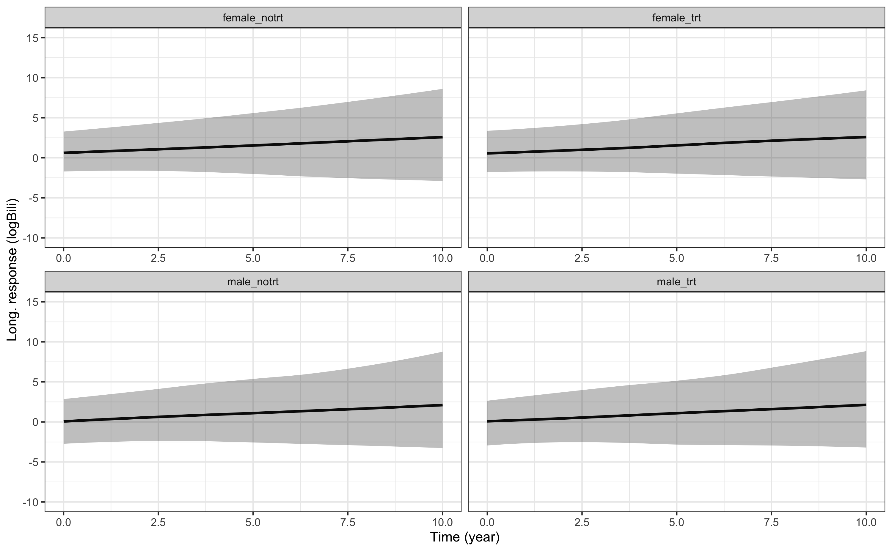

Because we are marginalising over the distribution of the
individual-specific parameters, we are incorporating all the variation
related to between-individual differences, and therefore the prediction
interval is wide (shown by the shaded area around the marginal
longitudinal trajectory). The magnitude of the effects of both `sex` and
`trt` are relatively small compared to the population-level effect of
`year` and the between-individual variation in the intercept and slope.
For example, here are the point estimates for the population-level
effects of `sex`, `trt`, and `year`:

``` r
fixef(mod3)$Long1
```

    (Intercept)        sexf         trt        year 
     0.26316891  0.47545756 -0.06287211  0.22199841 

and here are the standard deviations for the individual-level random
effects:

``` r
VarCorr(mod3)
```

     Groups Name              Std.Dev. Corr                
     id     Long1|(Intercept) 1.241233                     
            Long1|year        0.188221  0.490              
            Long2|(Intercept) 0.513955 -0.652 -0.494       
            Long2|year        0.096057 -0.567 -0.810  0.454

This shows us that the point estimates for the population-level effects
of `sex` and `trt` are 0.57 and -0.10, respectively, whereas the
standard deviation for the individual-specific intercept and slope
parameters are 1.24 and 0.19; hence, any differences due to the
population-level effects of gender and treatment (i.e. differences in
the black line across the four panels of the plot) are swamped by the
width of the uncertainty intervals (i.e. the grey shaded areas).

#### Standardised survival curves

In this example we show how a standardised survival curve can be
obtained, where the \\i = 1,...,N^{pred}\\ individuals used in
generating the standardised survival curve are the same individuals that
were used in estimating the model. We will obtain the survival curve for
the multivariate joint model estimated in an earlier example (`mod3`).
The `standardise = TRUE` argument to `posterior_survfit` specifies that
we want to obtain individual-specific predictions of the survival curve
and then average these. Because, in practical terms, we need to obtain
survival probabilities at time \\t\\ for each individual and then
average them we want to explicitly specify the values of \\t\\ we want
to use (and the same values of \\t\\ will be used for individuals). We
specify the values of \\t\\ to use via the `times` argument; here we
will predict the standardised survival curve at time 0 and then for
convenience we can just specify `extrapolate = TRUE` (which is the
default anyway) which will mean we automatically predict at 10 evenly
spaced time points between 0 and the maximum event or censoring time.

``` r
p1 <- posterior_survfit(mod3, standardise = TRUE, times = 0)
head(p1) # data frame with standardised survival probabilities
```

        year survpred  ci_lb  ci_ub
    1 0.0000   1.0000 1.0000 1.0000
    2 1.0154   0.8243 0.7659 0.8943
    3 2.0307   0.7309 0.6606 0.7805
    4 3.0461   0.6789 0.6133 0.7221
    5 4.0614   0.6351 0.5746 0.6877
    6 5.0768   0.5934 0.5386 0.6456

``` r
plot(p1) # plot the standardised survival curve
```

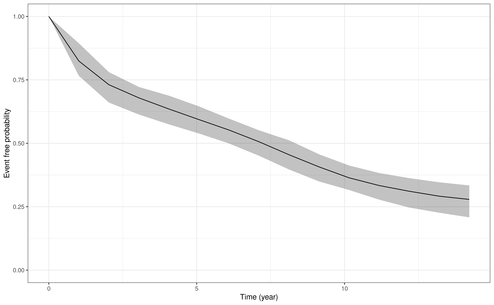

## References

1.  Henderson R, Diggle P, Dobson A. Joint modelling of longitudinal
    measurements and event time data. *Biostatistics*
    2000;**1**(4):465-80.
2.  Wulfsohn MS, Tsiatis AA. A joint model for survival and longitudinal
    data measured with error. *Biometrics* 1997;**53**(1):330-9.
3.  Tsiatis AA, Davidian M. Joint modeling of longitudinal and
    time-to-event data: An overview. *Stat Sinica*
    2004;**14**(3):809-34.
4.  Gould AL, Boye ME, Crowther MJ, Ibrahim JG, Quartey G, Micallef S,
    et al. Joint modeling of survival and longitudinal non-survival
    data: current methods and issues. Report of the DIA Bayesian joint
    modeling working group. *Stat Med*. 2015;**34**(14):2181-95.
5.  Rizopoulos D. *Joint Models for Longitudinal and Time-to-Event Data:
    With Applications in R* CRC Press; 2012.
6.  Liu G, Gould AL. Comparison of alternative strategies for analysis
    of longitudinal trials with dropouts. *J Biopharm Stat*
    2002;**12**(2):207-26.
7.  Prentice RL. Covariate Measurement Errors and Parameter-Estimation
    in a Failure Time Regression-Model. *Biometrika*
    1982;**69**(2):331-42.
8.  Baraldi AN, Enders CK. An introduction to modern missing data
    analyses. *J Sch Psychol* 2010;**48**(1):5-37.
9.  Philipson PM, Ho WK, Henderson R. Comparative review of methods for
    handling drop-out in longitudinal studies. *Stat Med*
    2008;**27**(30):6276-98.
10. Pantazis N, Touloumi G. Bivariate modelling of longitudinal
    measurements of two human immunodeficiency type 1 disease
    progression markers in the presence of informative drop-outs.
    *Applied Statistics* 2005;**54**:405-23.
11. Taylor JM, Park Y, Ankerst DP, et al. Real-time individual
    predictions of prostate cancer recurrence using joint models.
    *Biometrics* 2013;**69**(1):206-13.
12. Brilleman SL, Crowther MJ, Moreno-Betancur M, Buros Novik J,
    Wolfe R. Joint longitudinal and time-to-event models via Stan. *In:
    Proceedings of StanCon 2018.*
    <https://github.com/stan-dev/stancon_talks>
13. Stan Development Team. *rstanarm: Bayesian applied regression
    modeling via Stan.* R package version 2.14.1.
    <https://mc-stan.org/>. 2016.
14. R Core Team. *R: A language and environment for statistical
    computing.* Vienna, Austria: R Foundation for Statistical Computing;
    2015.
15. Crowther MJ, Lambert PC, Abrams KR. Adjusting for measurement error
    in baseline prognostic biomarkers included in a time-to-event
    analysis: a joint modelling approach. *BMC Med Res Methodol*
    2013;**13**.
16. Hickey GL, Philipson P, Jorgensen A, Kolamunnage-Dona R. Joint
    modelling of time-to-event and multivariate longitudinal outcomes:
    recent developments and issues. *BMC Med Res Methodol*
    2016;**16**(1):117.
17. Rizopoulos D, Ghosh P. A Bayesian semiparametric multivariate joint
    model for multiple longitudinal outcomes and a time-to-event. *Stat
    Med*. 2011;**30**(12):1366-80.
18. Laurie DP. Calculation of Gauss-Kronrod quadrature rules. *Math
    Comput* 1997;**66**(219):1133-45.
19. Rizopoulos D. Dynamic Predictions and Prospective Accuracy in Joint
    Models for Longitudinal and Time-to-Event Data. *Biometrics*
    2011;**67**(3):819-829.
20. Therneau T, Grambsch P. *Modeling Survival Data: Extending the Cox
    Model* Springer-Verlag, New York; 2000. ISBN: 0-387-98784-3

------------------------------------------------------------------------

1.  By “true” value of the biomarker, we mean the value of the biomarker
    which is not subject to measurement error or discrete time
    observation. Of course, for the expected value from the longitudinal
    submodel to be considered the so-called “true” underlying biomarker
    value, we would need to have specified the longitudinal submodel
    appropriately!

2.  We refer the reader to the priors
    [vignette](https://mc-stan.org/rstanarm/articles/priors.md) for a
    discussion of the possible prior distributions.

3.  These random draws from the posterior distribution of the
    group-specific parameters are stored each time a joint model is
    estimated using `stan_glmer`, `stan_mvmer`, or `stan_jm`; they are
    saved under an ID value called `"_NEW_"`
